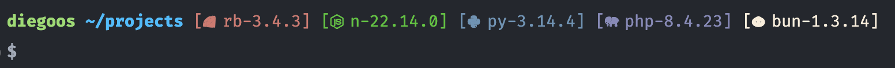

# CleanSH ZSH Theme

CleanSH is a lightweight Zsh theme for Oh My Zsh. The prompt shows your
user, working directory, Git branch, and runtime versions (Ruby, Node,
Python, PHP, Bun) with compact Nerd Font icons.

## Features

- User, path, Git branch, and runtime versions in one prompt
- Versions from the first available manager: `mise`, then `asdf`, then
  `nvm` (never combined)
- Supports `ruby`, `node`/`nodejs`, `python`, `php`, and `bun`
- Async version refresh when Oh My Zsh supports it; sync fallback otherwise
- Per-directory cache; refreshes after `mise` / `asdf` / `nvm` commands
- Optional hide list via `CLEANSH_DISABLE_VERSION`
- Dirty Git branches marked with a red `*`; clean branches unmarked
- Requires a Nerd Font (for example Fira Code Nerd Font)

## Screenshot



## Install

### Prerequisites

Install a Nerd Font and set it as your terminal font:

```sh
brew install --cask font-fira-code-nerd-font
```

### Installation

1. Copy `cleanzsh.zsh-theme` to `~/.oh-my-zsh/custom/themes/`.
2. In `~/.zshrc`, set:

```sh
ZSH_THEME="cleanzsh"
```

1. Reload the shell (`source ~/.zshrc` or open a new terminal).

## Configuration

### Disable runtime versions

Skip tools with a comma-separated list. Accepted values: `ruby`, `node`
(or `nodejs`), `python`, `php`, `bun`. Matching is case-insensitive;
spaces around names and unknown names are ignored.

```sh
# Hide PHP and Ruby
export CLEANSH_DISABLE_VERSION="php,ruby"
```

```sh
# Show only Node
export CLEANSH_DISABLE_VERSION="ruby,python,php,bun"
```

Add the export to `~/.zshrc`. Changes apply on the next prompt (async mode
may briefly show `[…]`).

## Notes

- Product name is **CleanSH**; theme id / file is `cleanzsh`; env vars use
  the `CLEANSH_` prefix.
- Only `mise`, `asdf`, and `nvm` are used — no `rvm`, `rbenv`, or direct
  `ruby -v` / `bun --version` fallbacks.
- Managers may be a shell function or a binary on `PATH` (function wins
  when both exist).
- Async uses Oh My Zsh’s experimental `_omz_register_handler`; without it,
  versions update in a sync `precmd` path.
- Cache invalidation after manager commands peels common wrappers
  (`command`, `sudo`, `env`, `nice`, …), POSIX `--`, and typical flags
  (`sudo -u user`, `env -i`, `nice -n 10`). Not covered: combined short
  flags like `sudo -nu`, or chains such as `npm && mise`.
- Git uses `$(git_prompt_info)` so OMZ git async and `%` escaping apply
  (`zstyle ':omz:alpha:lib:git' async-prompt …` before sourcing Oh My Zsh).
- Version strings from managers are allowlisted before they reach the
  prompt.

## License

See the repository [LICENSE](LICENSE) file.
