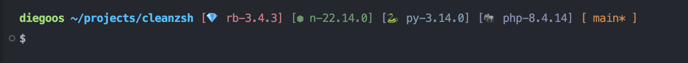

# CleanSH ZSH Theme

CleanSH is a lightweight, performance-minded Zsh prompt theme that shows the current user,
working directory, Git branch and detected runtime versions (Ruby, Node, Python, PHP) with
compact icons and minimal overhead.

## Features

- Displays runtime versions detected from `mise`, `asdf`, `nvm`, `rvm` or `rbenv`.
- Per-directory caching to avoid repeated tool calls.
- Single-process parsing (reduces forks) for speed.
- Auto-refreshes when version managers change versions (via `preexec`).
- Small Nerd Font icons next to each version.
- Requires a Nerd Font (such as Fira Code Nerd Font) for proper icon rendering.

## Screenshot



## Install

### Prerequisites

Install the **Fira Code Nerd Font** to display the version icons properly:

```sh
brew install --cask font-fira-code-nerd-font
```

Then set it as your terminal's font in your terminal settings.

### Installation

Copy `cleanzsh.zsh-theme` into your Zsh themes directory (for example `~/.oh-my-zsh/custom/themes/`).

Then set the theme in your `~/.zshrc`:

```sh
ZSH_THEME="cleanzsh"
```

Reload the shell or source your `~/.zshrc`.

## Notes

- The theme tries to be non-invasive: it does not override existing tool functions and uses
  `preexec`/`precmd` hooks to keep the prompt up-to-date.
- Some version managers expose shell functions (e.g. `nvm`); these are detected when available.

## License

See the repository [LICENSE](LICENSE) file.
